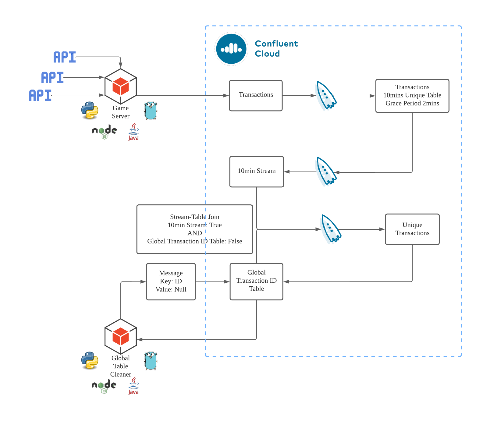
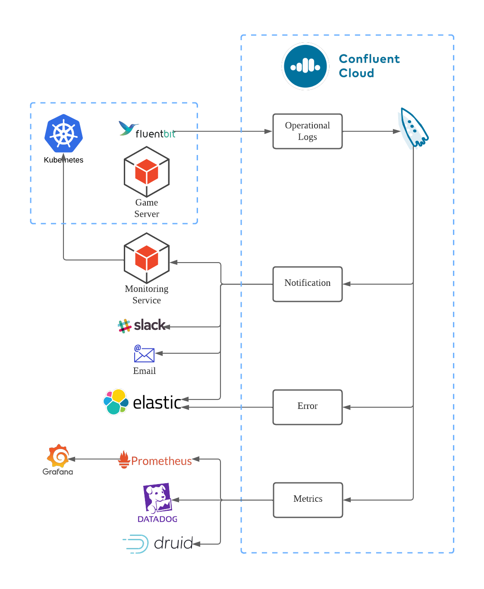

# Gaming Platform Unlocked - Data Streaming Pipeline for Gaming Applications

In this demonstration, we present three essential use cases that illustrate the versatility and reliability of Confluent Cloud for building your data streaming pipeline for your gaming applications. 

* Producing Multiple Event Types in Single Topic
* Preventing duplicate message with ksqlDB
* Observability of the gaming platform

These use cases provide valuable insights into the technical requirements and considerations for creating a robust and efficient gaming data streaming system. By exploring these scenarios, you will gain a deeper understanding of how our platform can be adapted to various real-world applications.

## Architectural Diagrams:

### 1. Multiple Event Types in Single Topic:

sample text here:

<div align="center"> 
  
</div>

### 2. Preventing duplicate message with ksqlDB:

sample text here:

<div align="center"> 
  
</div>

### 3. Observability of the gaming platform:

sample text here:

<div align="center"> 
  
</div>

# Requirements

In order to successfully complete this demo you need to install few tools before getting started.

- If you don't have a Confluent Cloud account, sign up for a free trial [here](https://www.confluent.io/confluent-cloud/tryfree).
- Install Confluent Cloud CLI by following the instructions [here](https://docs.confluent.io/confluent-cli/current/install.html).
- Please follow the instructions to install Terraform if it is not already installed on your system [here](https://developer.hashicorp.com/terraform/tutorials/aws-get-started/install-cli)  
- Install Python on your local system by following the instructions [here](https://realpython.com/installing-python).
   > **Note:** This demo uses Python 3.11.3 version

# Prerequisites

## Confluent Cloud

1. Sign up for a Confluent Cloud account [here](https://www.confluent.io/get-started/).
2. After verifying your email address, access Confluent Cloud sign-in by navigating [here](https://confluent.cloud).
3. When provided with the _username_ and _password_ prompts, fill in your credentials.

   > **Note:** If you're logging in for the first time you will see a wizard that will walk you through the some tutorials. Minimize this as you will walk through these steps in this guide.

4. Create Confluent Cloud API keys by following the steps in UI. Click on the hamburger icon that is present on the right top section and click on Cloud API Key.

<div align="center"> 
  
</div>

5. Now Click Add Key to generate API keys and store it as we will be using that key in this demo.

 <div align="center"> 
  
</div>
    
   > **Note:** This is different than Kafka cluster API keys.

## Setting up your Confluent Cloud Infrastructure

1. This demo uses Terraform  to spin up resources that are needed.

2. Navigate to the repo's terraform directory.

   ```bash
   cd terraform
   ```

3. Update the `terraform/variables.tf` file for the following variables with your Cloud API credentials from the previous step.

  ```
  variable "confluent_cloud_api_key" {
    default = "Replace with your API Key created during pre-requsite"
  }

  variable "confluent_cloud_api_secret" {
    default = "Replace with your API Secret created during pre-requsite"   
  }
  ```

4. Initialize Terraform within the directory.

   ```
   terraform init
   ```

3. Apply the plan to create the infrastructure. This should take few minutes to setup.

   ```
   terraform apply 
   ```

   > **Note:** Read the `main.tf` configuration file [to see what will be created](./terraform/main.tf).

4. Once the Infrastructure is setup, you can see that the Bootstrap Server, API Key and Secret Values are displayed on the terminal (API Secret will be marked as sensitive). Use the following command to reveal the API Secret.

  ```
  terraform output -raw client_api_secret
  ```

5. Store the Bootstrap URL, API Key/Secret values and return to your Confluent Cloud dashboard and continue with the further steps for the Implementation

## Setting up Python Environment to run scripts:

1. Install the below required modules in python to run the python scripts as directed in the following steps for implementation of the demo.

  ```pip3 install confluent-kafka```

  ```pip3 install fastavro```

# Execution and Demo:

We will cover this whole use case in three different parts as given in the architectures above to get a better understanding of the concepts and provide you the opportunity to tweak few things and experiement stuff on your own.

## Producing Multiple Event Types in Single Topic

1. Replace the below mentioned configuration settings in the code to point to your Confluent Cloud cluster that you created.
    
```
BOOTSTRAP_SERVERS = # Replace with your Confluent Cloud bootstrap server endpoint
SASL_USERNAME = # Replace with your Cluster API key
SASL_PASSWORD = # Replace with your Cluster API secret
```
  
  > To obtain the following details, navigate to the Clients section on the Confluent Cloud UI and select Python as the script type. From there, you can copy the bootstrap server and API Key details and replace them in the code.

<div align="center"> 
  
</div>

2. Please run the Python script using the following syntax:

```bash 
python3 multiple_events_to_topic.py
```