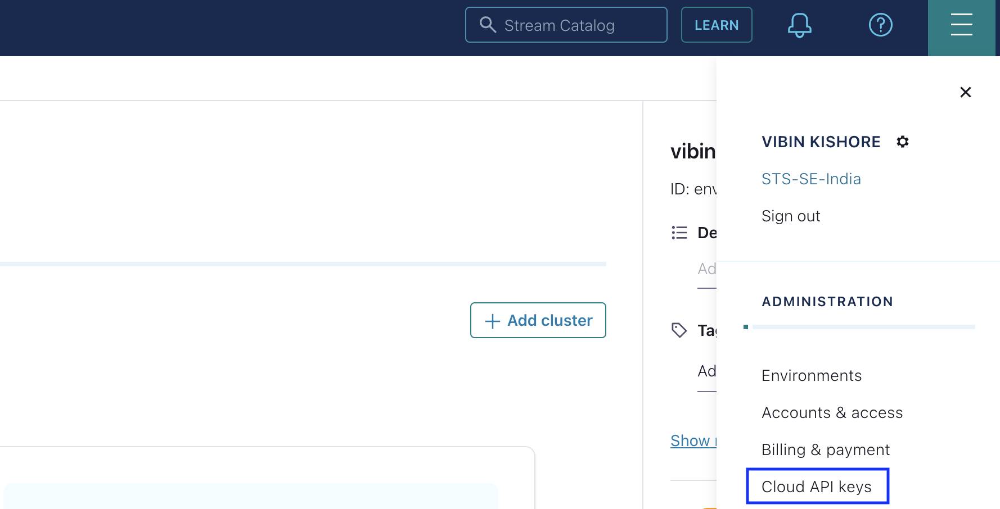
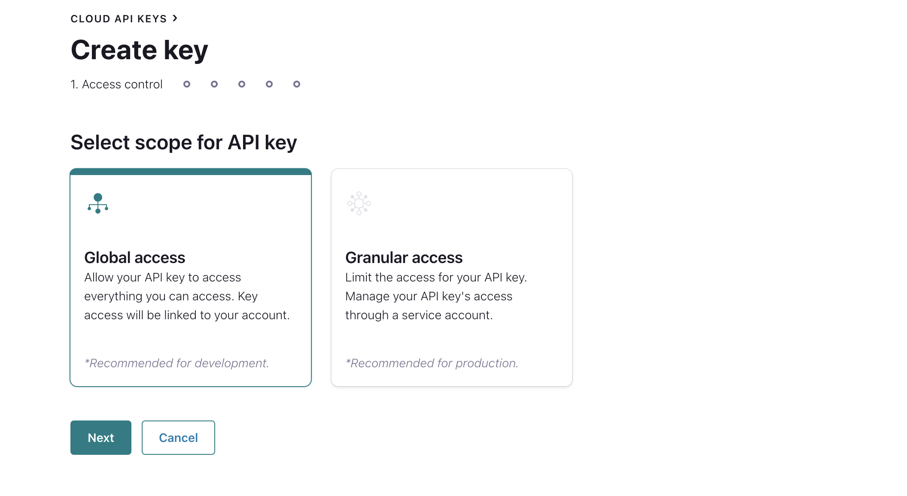
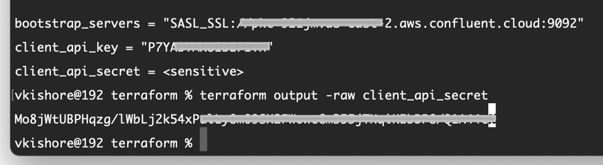
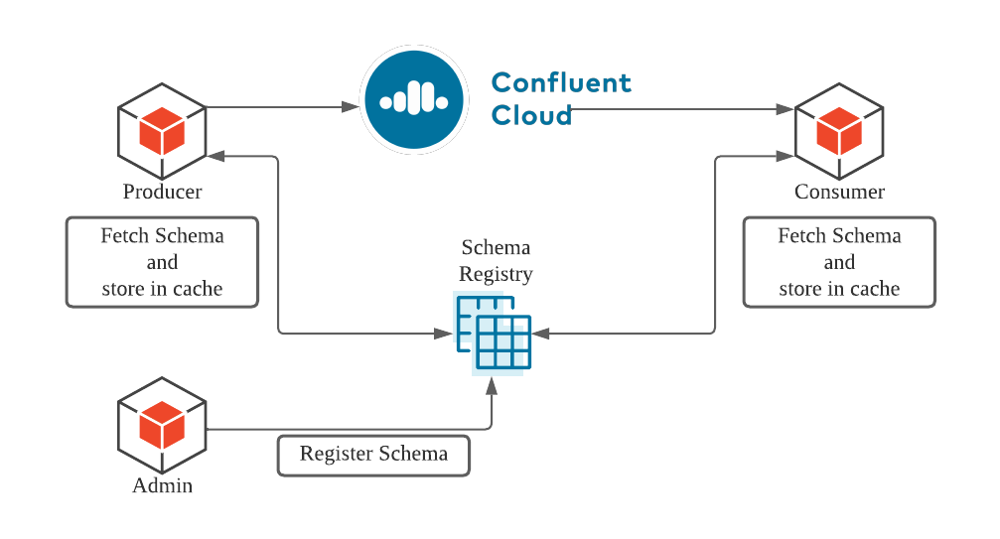
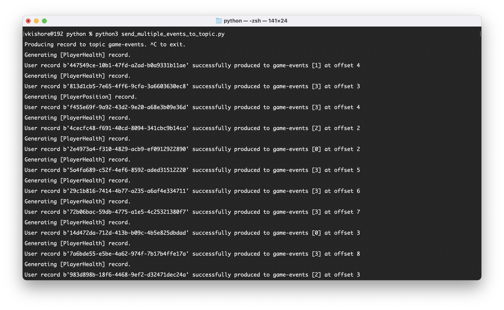
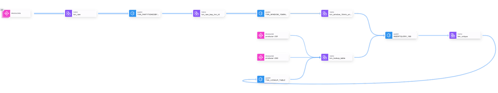
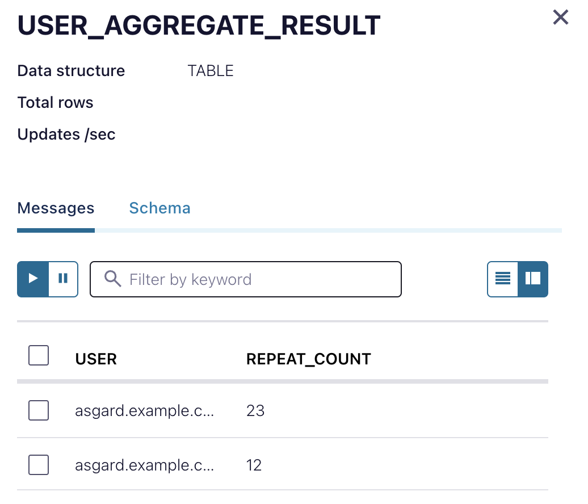

# Gaming Platform Unlocked - Data Streaming Pipeline for Gaming Applications

In this demonstration, we present three essential use cases that illustrate the versatility and reliability of Confluent Cloud for building your data streaming pipeline for your gaming application. These use cases provide valuable insights into the technical requirements and considerations for creating a robust and efficient gaming data streaming system.

* Producing Multiple Event Types in Single Topic
* Preventing duplicate message with ksqlDB
* Observability of the gaming platform

 By exploring these scenarios, you will gain a deeper understanding of how Confluent Cloud can be adapted to various real-world applications.

## Requirements

In order to successfully complete this demo you need to install few tools before getting started.

- If you don't have a Confluent Cloud account, sign up for a free trial [here](https://www.confluent.io/confluent-cloud/tryfree).
- Install Confluent Cloud CLI by following the instructions [here](https://docs.confluent.io/confluent-cli/current/install.html).
- Please follow the instructions to install Terraform if it is not already installed on your system [here](https://developer.hashicorp.com/terraform/tutorials/aws-get-started/install-cli)  
- Install Python on your local system by following the instructions [here](https://realpython.com/installing-python).
  
   > **Note:** This demo uses Python 3.11.3 version

- Download and install Fluent Bit based on your operating system. You can find installation instructions for various platforms on the [Fluent Bit download page](https://docs.fluentbit.io/manual/installation/getting-started-with-fluent-bit)

  > **Note:** In this demo, we are going to use Homebrew on Mac to install fluent-bit in our local machine.

## Prerequisites

### 1. Confluent Cloud

1. Sign up for a Confluent Cloud account [here](https://www.confluent.io/get-started/).
2. After verifying your email address, access Confluent Cloud sign-in by navigating [here](https://confluent.cloud).
3. When provided with the _username_ and _password_ prompts, fill in your credentials.

   > **Note:** If you're logging in for the first time you will see a wizard that will walk you through the some tutorials. Minimize this as you will walk through these steps in this guide.

4. Create *Confluent Cloud API keys* by following the steps in UI. Click on the hamburger icon that is present on the right top section and click on Cloud API Keys.

<div align="center"> 
  
</div>

5. In the Access Control menu, select Global Access and click on the Next Button

 <div align="center"> 
  
  <br>
</div>

6. Now Click Add Key to generate API keys and store it as we will be using this key on terraform to deploy the infrastructure.
    
   > **Note:** This is different than Kafka Cluster API keys.

### 2. Setting up your Confluent Cloud Infrastructure

This demo uses Terraform to spin up the entire infrastructure and the resources that are needed for this demo. This terraform code creates the confluent cloud cluster, ksqldb, schema registry and also topics that are needed for the demo.

2. Navigate to the repo's terraform directory.

  ```bash 
  cd terraform
  ```

3. Update the `terraform/variables.tf` file for the following variables with your Cloud API credentials from the previous step.

  ```
  variable "confluent_cloud_api_key" {
    default = "Replace with your API Key created during pre-requesite"
  }

  variable "confluent_cloud_api_secret" {
    default = "Replace with your API Secret created during pre-requesite"   
  }
  ```

4. Initialize Terraform within the directory.

  ```
  terraform init
  ```

5. Use the following command to create the terraform plan which validates all the components described in the terraform script

  ```
  terraform plan
  ```

6. Apply the plan to create the infrastructure. This should take few minutes to setup.

  ```
  terraform apply 
  ```

   > **Note:** Read the `main.tf` and the other component specific (.tf) configuration files [to see what will be created](./terraform/main.tf).

7. Once the Infrastructure is setup, you can see that the Bootstrap Server,Schema Registry Endpoint, API Key and Secret Values are displayed on the terminal (API Secret will be marked as sensitive). Use the following command to reveal the API Secret.

  ```
  terraform output -raw client_api_secret
  ```

<div align="center"> 
  
</div>

5. The follwoing credentials - *Bootstrap URL, Cluster API Key, Cluster API Secret, Scehma Registry URL, Schema Registry API Key, Schema Registry API Secret* are stored to credentials.txt file in the files directory.

   > **Note:** The python files in the further steps in the demo will read the credentials directly from the credentials.txt file, so refrain moving this file from the files directory.

### 3. Setting up Python Environment:

1. Install the below required modules in python to run the python scripts as directed in the following steps for implementation of the demo.

  ```
  pip3 install confluent-kafka
  ```

## Execution and Demo:

We will cover this whole use case in three different parts to get a better understanding of the concepts and provide you the opportunity to tweak few things and experiement stuff on your own.

### 1. Producing Multiple Event Types in Single Topic

In order to maintain order and process events of related data, storing multiple event types in one topic is crucial. Also, in order to reduce the transfer cost, integrating the producers and consumers with a schema registry will be the first item in your list.

### Architecture Diagram:

<div align="center"> 
  
</div>

### Implementation:

1. Navigate to the python directory from the root using the below command and locate the *send_multiple_events_to_topic.py* python script.

  ```bash
  cd python/
  ```

2. Please run the Python script using the following syntax:

```bash 
python3 send_multiple_events_to_topic.py
```

3. If the credentials were added properly, the script should run successfully and produce the following output.

<div align="center"> 
  
</div>

This python script sends two types of events *Player Health* and *Player Position* both to the topic *game-events* and the scema registry is configured to accept both schemas and thereby showcasing the implementation of the demo.

## 2. Preventing duplicate message with ksqlDB:

Even when you tune your producers based on best practices, message duplication can occur with any API communication. In order to process duplicate messages and discard them quickly, you can utilize ksqlDB with a twist

With KsqlDB, you can continuously transform, enrich, join, and aggregate your data using simple SQL syntax. You can gain value from your data directly from Confluent in real-time. 

Also, ksqlDB is a fully managed service within Confluent Cloud with a 99.9% uptime SLA. You can now focus on developing services and building your data pipeline while letting Confluent manage your resources for you.

### Generate Sample data using python:

Run the following command to generate data continously to the cluster for working with ksqldb in this demo.

  ```bash
  python3 produce_sample_data.py
  ```

### 1. Create a Stream into the ksqldb Stream Functions by updating the timestamp

  ```
  CREATE STREAM TXN_RAW (
      ID STRING,
      USER_ID STRING,
      TXN_TYPE STRING,
      TXN_TIMESTAMP STRING)
  WITH (KAFKA_TOPIC='txn_raw',
        TIMESTAMP='txn_timestamp',
        TIMESTAMP_FORMAT='yyyy-MM-dd HH:mm:ss',
        VALUE_FORMAT='JSON',
        PARTITIONS=3);

  ```

### 2. Create another Stream by repartioning the messages to handle all keyless messages stored in round robin fashion in the topics.

  ```
  CREATE STREAM TXN_PARTITIONEDBY_TXNID
    WITH (KAFKA_TOPIC='txn_raw_key_txn_id', 
          VALUE_FORMAT='AVRO',
          KEY_FORMAT='KAFKA') AS
      SELECT
          ID AS ID_KEY,
          AS_VALUE(ID) AS ID,
          USER_ID,
          TXN_TYPE
      FROM TXN_RAW
      PARTITION BY ID;

  ```

### 3. Create a Table to disable the buffering to get the results faster

  ```
  Add specific query property
  SET 'cache.max.bytes.buffering' = '0';

  CREATE TABLE TXN_WINDOW_10MIN_UNIQUE_TABLE
  WITH (KAFKA_TOPIC='txn_window_10min_unique',
      VALUE_FORMAT='AVRO',
      KEY_FORMAT='KAFKA')
  AS
    SELECT
        ID_KEY,
        EARLIEST_BY_OFFSET(ID) AS ID,
        EARLIEST_BY_OFFSET(USER_ID) AS USER_ID,
        EARLIEST_BY_OFFSET(TXN_TYPE) AS TXN_TYPE,
        COUNT(*) AS MESSAGE_NO
    FROM TXN_PARTITIONEDBY_TXNID
    WINDOW TUMBLING (SIZE 10 MINUTES, GRACE PERIOD 2 MINUTES)
    GROUP BY ID_KEY
    HAVING COUNT(*) = 1;
  ```

### 4. Create a new Stream to capture unique transactions every 10 minutes with a 2 minute grace period:

  ```
  CREATE STREAM TXN_WINDOW_10MIN_UNIQUE_STREAM (
    ID_KEY STRING KEY,
    ID STRING,
    USER_ID STRING,
    TXN_TYPE STRING,
    MESSAGE_NO BIGINT)
  WITH (KAFKA_TOPIC='txn_window_10min_unique',
        VALUE_FORMAT='AVRO',
        KEY_FORMAT='KAFKA');
  ```

### 5. Create a Stream of unique transactions:

  ```
  CREATE STREAM TXN_UNIQUE (
    ID_KEY STRING KEY,
    ID STRING,
    USER_ID STRING,
    TXN_TYPE STRING,
    MESSAGE_NO BIGINT)
  WITH (KAFKA_TOPIC='txn_unique',
        VALUE_FORMAT='AVRO',
        KEY_FORMAT='KAFKA',
        PARTITIONS=3);
  ```

### 6. Create a Transaction Lookup Table which will create a timestamp for the first event of the transaction.

  ```
  CREATE TABLE TXN_LOOKUP_TABLE
  WITH (KAFKA_TOPIC='txn_lookup_table',
        VALUE_FORMAT='AVRO',
        KEY_FORMAT='KAFKA')
    AS
      SELECT ID_KEY,
          EARLIEST_BY_OFFSET(ID) AS ID,
          TIMESTAMPTOSTRING(EARLIEST_BY_OFFSET(ROWTIME), 'yyyy-MM-dd HH:mm:ss.SSS') AS MSG_ROWTIME,
          EARLIEST_BY_OFFSET(ROWTIME) AS MSG_EPOCH
      FROM TXN_UNIQUE
      GROUP BY ID_KEY;
  ```

### 7. Check duplicate transactions arrived after the 10 minutes window with the global table and add if not present in the lookup table

  ```
  INSERT INTO TXN_UNIQUE
    SELECT
        T10.ID_KEY AS ID_KEY,
        T10.ID AS ID,
        T10.USER_ID AS USER_ID,
        T10.TXN_TYPE AS TXN_TYPE,
        T10.MESSAGE_NO AS MESSAGE_NO
    FROM TXN_WINDOW_10MIN_UNIQUE_STREAM T10
        LEFT JOIN TXN_LOOKUP_TABLE TLT ON T10.ID_KEY = TLT.ID_KEY
    WHERE T10.ID_KEY IS NOT NULL
        AND TLT.ID_KEY IS NULL
    EMIT CHANGES;
  ```

### 8. Create a Stream for lookup table cleaning by inserting a tombstone message as ksqldb memory

  ```
  CREATE STREAM TXN_LOOKUP_TABLE_CLEANING_STREAM (
    ID_KEY STRING KEY,
    DUMMY STRING) 
  WITH (KAFKA_TOPIC='txn_lookup_table', 
       VALUE_FORMAT='AVRO',
       KEY_FORMAT='KAFKA');
  ```

Even though it looks like a quick fix to generate TTL in ksqlDB, you need to be careful while sending Tombstones because some of the Apache Kafka Clients have different default hashing strategies. Using a disparate hashing method will generate a different hash key which will cause the keys ending up in different partitions. It will defeat the purpose of this cleaning step and make sure that clients use the same hashing strategy as the ksqlDB.

### Stream Lineage:

Once you have completed all the steps, you will have the complete stream lineage as shown below:

  <div align="center"> 
    
  </div>

You can access the Stream Lineage Feature inside Confluent Cloud by accessing the *Stream Lineage* menu in the left sidebar of the Confluent Cloud Dashboard.

## Observability of the gaming platform

Creating observability for mission- critical applications can be challenging, but with a decent strategy you will be able to collect important metrics and errors from your servers.

We are going to use a tiny software called fluent-bit to demonstrate the observability feature. Please follow the following steps to continue with the demo.

### Start Fluent-Bit service:

Run the following command from the root directory to start the fluent bit service on your local machine.

  ```
  fluent-bit -c fluent-bit/fluent-bit.conf
  ```
  > Note: The fluent bit configuration will be autopopulated with the necessary credentials by terraform to connect to confluent cloud.

### Check logs on Confluent Cloud:

The fluent bit client sends a load of sample data located in the fluent-bit/syslog.log file to the kafka cluster. You can check this by heading over to Confluent Cloud and check the messages inside the **logs** topic.

### Use kqlDB to check for ssh attacks in the logs:

Let us see a quick example on how to use ksqldb to process the logs and look for ssh attacks. Follow the given steps to create a ssh_attacks stream based on the logs received.

1. Create a Stream from the logs topic:

  ```bash
  CREATE STREAM syslog_stream (
    timestamp DOUBLE, 
    log STRING) 
  WITH (
    KAFKA_TOPIC='logs', 
    VALUE_FORMAT='JSON');

  ```

2. Create actionable stream of SSH attacks, filtering syslog messages where user is invalid

  ```bash
  CREATE STREAM ssh_attacks_stream AS
    SELECT
      EXTRACTJSONFIELD(log, '$.ts') AS log_timestamp,
      EXTRACTJSONFIELD(log, '$.host') AS host,
      EXTRACTJSONFIELD(log, '$.message') AS message,
      EXTRACTJSONFIELD(log, '$.remote_address') AS remote_address,
      EXTRACTJSONFIELD(log, '$.facility') AS facility
    FROM logs
    WHERE EXTRACTJSONFIELD(log, '$.message') LIKE '%Invalid user%';
  ```

3. Create an enriched ssh_attacks_stream replacing the invalid users to attack users

  ```bash
  CREATE STREAM enriched_log_stream AS
  SELECT
    LOG_TIMESTAMP,
    HOST,
    CASE
      WHEN MESSAGE LIKE '%Invalid user%' THEN 'Attack user'
      ELSE FACILITY
    END AS FACILITY,
    REMOTE_ADDRESS
  FROM ssh_attacks_stream;
  ```

4. Create a user aggregate table

  ```bash
  CREATE TABLE user_aggregate_table AS
  SELECT
    HOST AS USER,
    COUNT(*) AS REPEAT_COUNT
  FROM enriched_log_stream
  GROUP BY HOST;
  ```

5. Create a persistent query to continuously update the user aggregate

  ```bash
  CREATE TABLE user_aggregate_result AS
  SELECT * FROM user_aggregate_table;
  ```

### Output data from Enriched Logs:

  <div align="center"> 
    
  </div>

We have obtained an enriched log stream using ksqldb and also we have created a table with the number of attack attempts based on the host.

This data can further be consumed into other alerting or notifications services to trigger alerts on the system.